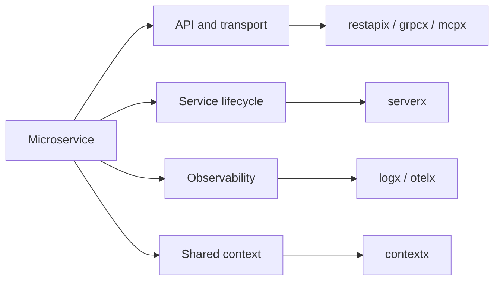
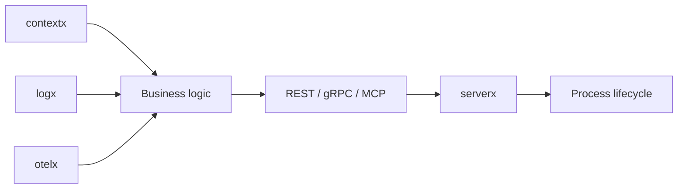

# go-bedrock

`go-bedrock` is a collection of ready-to-use Go packages for building microservices faster and more consistently.

The repository contains shared technical building blocks and common best practices for service infrastructure. It does not contain business logic. Each package is an independent Go module, so a service can import only what it needs.

## Overview



Application code owns domain rules and business workflows. `go-bedrock` provides the technical foundation around them:

- safe defaults for network servers;
- consistent startup and graceful shutdown;
- structured and trace-aware logging;
- tracing, metrics, and context propagation;
- reusable integration patterns for HTTP, gRPC, and MCP.

## Packages

| Package | Purpose |
| --- | --- |
| [`contextx`](contextx/README.md) | Store and read shared request, identity, and trace metadata from `context.Context`. |
| [`logx`](logx/README.md) | Provide structured Zap logging with request and trace correlation. |
| [`otelx`](otelx/README.md) | Configure OpenTelemetry traces, metrics, and propagation. |
| [`serverx`](serverx/README.md) | Manage component startup, failure handling, signals, admin endpoints, and graceful shutdown. |
| [`restapix`](restapix/README.md) | Run a Gin HTTP API with safe server defaults under the `serverx` lifecycle. |
| [`grpcx`](grpcx/README.md) | Run a gRPC server under the `serverx` lifecycle. |
| [`mcpx`](mcpx/README.md) | Run an MCP Streamable HTTP server under the `serverx` lifecycle. |

Each package has a focused README and a separate `USAGE.md` with installation, configuration, and integration examples.

## Install

Install only the modules required by the service:

```sh
go get github.com/LeeTun2k2/go-bedrock/serverx@latest
go get github.com/LeeTun2k2/go-bedrock/restapix@latest
go get github.com/LeeTun2k2/go-bedrock/logx@latest
```

Replace the package names with the modules needed by the application.

## Integration model



A typical service:

1. Initializes telemetry and logging.
2. Creates one or more transport servers.
3. Registers routes, RPC services, tools, or background workers.
4. Registers all long-running components with `serverx`.
5. Runs the service until cancellation, a signal, or a component failure.

## Design principles

- **No business logic:** packages stay independent of product domains.
- **Small and composable:** use one package or combine several packages.
- **Safe by default:** network and shutdown behavior use production-minded defaults.
- **Explicit configuration:** security-sensitive behavior remains visible to the service.
- **Standard Go APIs:** packages build on `context.Context`, `net/http`, gRPC, OpenTelemetry, Zap, and Gin.
- **Bounded shutdown:** long-running resources stop through contexts and deadlines.

## Requirements

- Go 1.27.1 or later.

## License

See [LICENSE](LICENSE).
