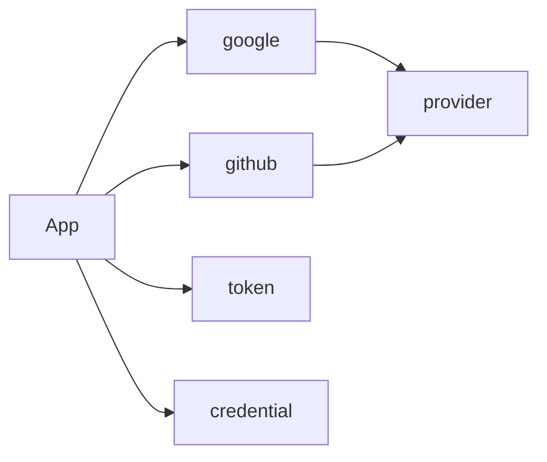

# authx

`authx` provides small authentication packages for services built on `go-bedrock`.

It decouples core authentication mechanisms (external identity providers, session JWT management, Argon2id secrets, OAuth primitives, and HTTP credential parsing) from service-specific identity persistence, policies, and workflows.

See [USAGE.md](USAGE.md) for usage examples and guidelines.

## Structure

- `google`: Google OpenID Connect provider
- `github`: GitHub OAuth provider
- `provider`: shared provider contract, errors, and identity normalization
- `token`: ES256 session tokens, claims, and key parsing
- `credential`: client-secret hashing and HTTP credential parsing
- `oauth`: state, nonce, authorization code, and PKCE helpers
