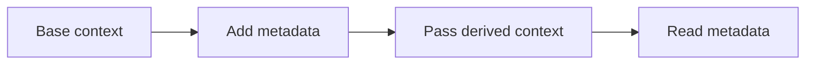

# Using contextx

## Install

```sh
go get github.com/LeeTun2k2/go-bedrock/contextx@latest
```

## Configure

No setup is required. Start with an existing non-nil `context.Context`.

Built-in helpers store strings under the exported `Key...` constants. A missing value or a value of the wrong type returns the zero value.

## Integrate

```go
package main

import (
	"context"
	"fmt"

	"github.com/LeeTun2k2/go-bedrock/contextx"
)

func callService(ctx context.Context) {
	fmt.Println(
		contextx.GetRequestID(ctx),
		contextx.GetUserID(ctx),
		contextx.GetTenantID(ctx),
	)
}

func main() {
	ctx := context.Background()
	ctx = contextx.SetRequestID(ctx, "req-123")
	ctx = contextx.SetUserID(ctx, "user-456")
	ctx = contextx.SetTenantID(ctx, "tenant-789")

	callService(ctx)
}
```

## Lifecycle

Values follow the derived context across call boundaries. There is no separate startup or shutdown step.



## Avoid

- Do not pass a nil context.
- Do not store secrets, large objects, or optional function parameters in a context.
- Do not use the same key with different value types. The generic getters return a zero value on a type mismatch.
- Do not expect HTTP header getters to read an `http.Request`; they read values already stored in the context under the matching header key.
