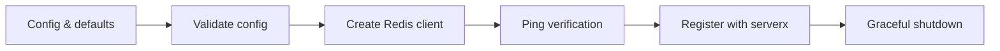

# Using redisx

## Install

```sh
go get github.com/leetun2k2/go-bedrock/redisx@latest
```

## Configure

- `Addr`: Redis server address formatted as `host:port`. Defaults to `127.0.0.1:6379`. Invalid addresses or missing ports are rejected.
- `Username`: Username for Redis ACL authentication (Redis 6.0+). Defaults to empty (unauthenticated or default user).
- `Password`: Password for Redis authentication. Defaults to empty. Passwords are never logged or exposed in error messages. Secrets must come from runtime configuration (such as environment variables or secret managers), never hardcoded.
- `DB`: Database number to select after connecting. Defaults to `0`. Negative database numbers are rejected.
- `TLSEnabled`: Enable TLS encryption for the connection. Defaults to `false`.
- `TLSServerName`: Server name used for TLS SNI verification. Optional; defaults to the hostname from `Addr` when omitted. Setting this when `TLSEnabled` is `false` is rejected.
- `DialTimeout`: Timeout for establishing new TCP connections. Defaults to `5s`. Negative durations are rejected.
- `ReadTimeout`: Timeout for socket reads. Defaults to `3s`. Negative durations are rejected.
- `WriteTimeout`: Timeout for socket writes. Defaults to `3s`. Negative durations are rejected.
- `PoolSize`: Maximum number of socket connections in the connection pool. Defaults to `10`. Must be greater than zero; negative values are rejected.
- `MinIdleConns`: Minimum number of idle connections maintained in the pool. Defaults to `2` (capped at `PoolSize`). Must not be negative or exceed `PoolSize`.
- `MaxIdleTime`: Maximum duration an idle connection can remain in the pool before being closed. Defaults to `30m`. Negative durations are rejected.
- `MaxConnAge`: Maximum lifetime of a connection before being closed and replaced. Defaults to `1h`. Negative durations are rejected.

Negative duration or count values are rejected.

## API Choice

`redisx` exposes the concrete `*redis.Client` (via `Client()`) rather than `redis.UniversalClient`. Because `redisx` specifically manages a standalone single-node Redis deployment (using a single `Addr` and database number `DB`), `*redis.Client` provides the smallest, most direct API surface needed without introducing unnecessary interface abstractions or multi-node routing overhead.

## Setup

```go
ctx := context.Background()
client, err := redisx.New(ctx, redisx.Config{
	Addr:     "127.0.0.1:6379",
	Password: os.Getenv("REDIS_PASSWORD"),
})
if err != nil {
	log.Fatal(err)
}
defer client.Close()
```

## Integrate

```go
package main

import (
	"context"
	"log"
	"os"
	"time"

	"github.com/leetun2k2/go-bedrock/logx"
	"github.com/leetun2k2/go-bedrock/redisx"
	"github.com/leetun2k2/go-bedrock/serverx"
)

func main() {
	ctx := context.Background()

	logger, err := logx.New(&logx.LoggerConfig{Production: true})
	if err != nil {
		log.Fatal(err)
	}

	// 1. Config creation (secrets must come from runtime configuration)
	cfg := redisx.Config{
		Addr:         "127.0.0.1:6379",
		Password:     os.Getenv("REDIS_PASSWORD"),
		DB:           0,
		PoolSize:     20,
		MinIdleConns: 5,
		DialTimeout:  5 * time.Second,
		ReadTimeout:  3 * time.Second,
		WriteTimeout: 3 * time.Second,
	}

	// 2. Redis initialization (verifies connectivity with Ping)
	rdb, err := redisx.New(ctx, cfg)
	if err != nil {
		log.Fatal(err)
	}
	defer rdb.Close()

	// 3. Access to the Redis client for commands and pipelines
	if err := rdb.Client().Set(ctx, "sample_key", "value", 10*time.Minute).Err(); err != nil {
		log.Fatal(err)
	}

	// 4. Registration with serverx
	supervisor := serverx.New(serverx.Config{Name: "orders"}, logger)
	if err := supervisor.Register(rdb.Component()); err != nil {
		log.Fatal(err)
	}

	// 5. Run supervisor and handle graceful shutdown
	if err := supervisor.Run(ctx); err != nil {
		log.Fatal(err)
	}
}
```

## Lifecycle



## Avoid

- Do not hardcode passwords or secrets; always load them from runtime configuration.
- Do not log or expose raw passwords or credentials.
- Do not pass negative connection counts or timeouts.
- Do not configure `MinIdleConns` greater than `PoolSize`.
- Do not execute Redis commands after the client has closed.
