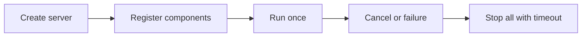

# Using serverx

## Install

```sh
go get github.com/leetun2k2/go-bedrock/serverx@latest
```

## Configure

- `Name` and `Production` appear in `/api/status`.
- `AdminAddr` defaults to `:4000`.
- `ShutdownTimeout` defaults to 15 seconds when zero or negative.

The admin server exposes `/api/status`, `/metrics`, and `/debug/pprof/`.

## Integrate

```go
package main

import (
	"context"
	"log"
	"time"

	"github.com/leetun2k2/go-bedrock/logx"
	"github.com/leetun2k2/go-bedrock/serverx"
)

func runWorker(ctx context.Context) error {
	<-ctx.Done()
	return nil
}

func main() {
	logger, err := logx.New(logx.LoggerConfig{Production: true})
	if err != nil {
		log.Fatal(err)
	}

	server := serverx.New(serverx.Config{
		Name:            "orders",
		Production:      true,
		ShutdownTimeout: 10 * time.Second,
	}, logger)

	err = server.Register(serverx.Component{
		Name:  "worker",
		Start: runWorker,
	})
	if err != nil {
		log.Fatal(err)
	}

	if err := server.Run(context.Background()); err != nil {
		log.Fatal(err)
	}
}
```

## Lifecycle



`Start` must block until cancellation or failure. A clean component shutdown returns `nil`. `Stop` is optional and runs concurrently for all components.

## Avoid

- Do not register a component after `Run` starts.
- Do not call `Run` more than once.
- Do not return from `Start` while the component is healthy; that is treated as a failure.
- Do not expose the admin address to untrusted networks without access controls because it includes metrics and profiling data.
